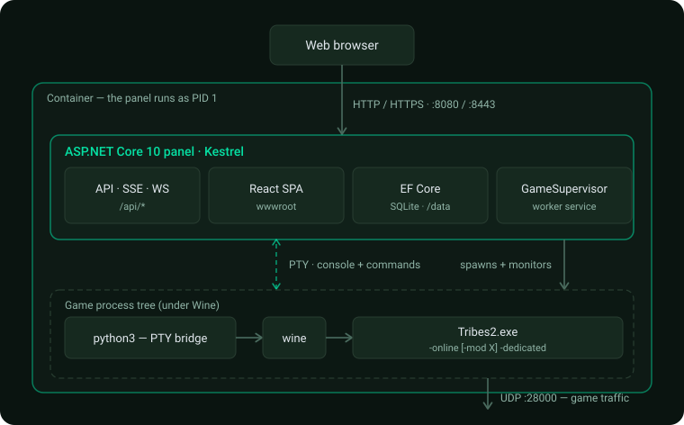

# Architecture

This image runs a **Tribes 2 (2002, Dynamix "V12"/Torque-lineage engine) dedicated server**
under **Wine** on the .NET runtime base image, with an **ASP.NET Core 10** control panel that
owns the whole thing.

## The big picture



## Why the panel owns the game (not the other way around)

The container's entrypoint is the **panel**, not the game:

```dockerfile
ENTRYPOINT ["/usr/bin/tini", "--", "dotnet", "/app/panel/TribesServerPanel.dll"]
```

That single decision drives the design:

- The **panel survives game crashes/stops.** If the game dies, the panel is still up to
  report it, restart it, or let an operator investigate. (If the game were PID 1, a crash
  would take the container down and you'd lose the console/UI.)
- The game runs as a **child Worker Service** (`GameSupervisor`), which starts/stops/restarts
  it, watches for unexpected exits, and records crashes.
- `tini` reaps the Wine process tree so there are no zombies.

## Components

### ASP.NET Core panel (`src/TribesServerPanel/`)
- **`Program.cs`** — composition root: Kestrel/TLS, EF Core + Identity, authorization
  policies, DI registrations, WebSockets, static files + SPA fallback, endpoint mapping.
- **Endpoints** — `Endpoints.cs` (account/console/server/config/users/audit/crashes),
  `FileEndpoints.cs` (file browser/editor/upload + revert), `TerminalEndpoints.cs`
  (root container terminal). All Minimal APIs.
- **`Services/GameSupervisor.cs`** — the hosted service that launches and supervises the game.
- **`Services/ConsoleHub.cs`** — a ring buffer of console lines + live fan-out to SSE clients.
- **`Services/TerminalSession.cs`** — the PTY-backed `bash` bridge for the root terminal.
- **`Services/FileAccess.cs`** — path scoping for the file browser (GameData vs anywhere).
- **`Data/`** — EF Core entities + `AppDbContext`; **`Bootstrap.cs`** seeds/migrates.
- **`Auth/`** — Identity user/role types and the rank-based `Roles` table.
- **`Tls/TlsConfigurator.cs`** — self-signed / Let's Encrypt / plain HTTP.
- **`ClientApp/`** — the React + Vite + TypeScript SPA (built to `wwwroot`).

### The game under Wine
- 32-bit Wine prefix at `/opt/wineprefix` (`WINEARCH=win32`).
- Game data at `/opt/wineprefix/drive_c/Dynamix/Tribes2/GameData` (`GAME_DIR`).
- The community **QoL patch** is overlaid at build time (its modern features live in
  `IFC22.dll`). See [Internals](internals.md).
- The game is PE-patched from a GUI app to a console app and driven on a pseudo-terminal so it
  runs **headless without xvfb**. See [Internals](internals.md).

### The supervisor loop
`GameSupervisor` (a `BackgroundService`) runs a simple desired-state loop:

1. On startup it reads `ServerSettings` from the DB. The game launches **only** if the server
   is **configured** and **Auto-Start** is on (see [Web panel & roles](web-panel.md)).
2. While "run" is desired and the process isn't alive, it spawns the game (via the PTY bridge),
   composing the final command line: `wine Tribes2.exe <LAUNCH_PARAMS with -mod inserted>`.
3. If the game exits **unexpectedly** (not an operator action), it records a
   [crash report](internals.md#crash-tracking) and (by default) restarts after a backoff.
4. Operator actions — restart, force-restart, stop — set the desired state and either ask the
   game to `quit();` gracefully or kill the Wine tree.

### Data flow for the console
- The game's stdout/stderr (on the PTY) is published line-by-line to `ConsoleHub`.
- Browsers subscribe via **Server-Sent Events** (`GET /api/console/stream`).
- Commands typed in the panel are written to the game's **stdin** on the PTY.

## Request/auth flow

1. The SPA calls `/api/account/login`; ASP.NET Core Identity sets an **HttpOnly cookie**.
2. Subsequent API calls carry the cookie; endpoints are guarded by **rank-based policies**
   (`User < Admin < SuperAdmin < root`) plus the orthogonal **Developer** capability for file
   editing. See [Web panel & roles](web-panel.md).
3. The SPA uses client-side routing (React Router); the server serves `index.html` for unknown
   non-API paths (`MapFallbackToFile`).

## See also
- [Configuration reference](configuration.md)
- [Internals: patch & headless](internals.md)
- [Web panel & roles](web-panel.md)
- Back to [docs index](README.md)
