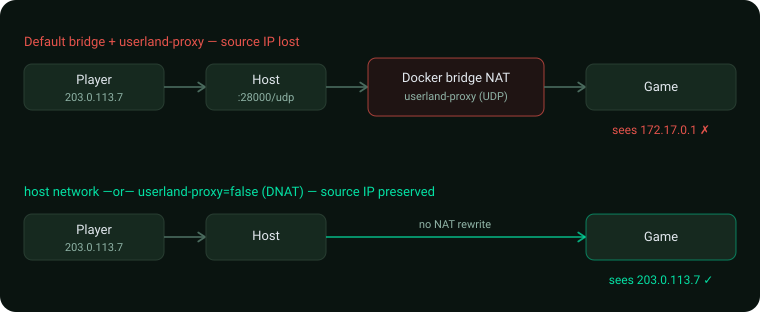

# Networking & client IPs

By default, Docker's bridge network **NATs** traffic to published ports. For a game server that's
a problem: the Tribes 2 server (and its admin/ban tooling, e.g. `t2csri/bans.cs`) needs the
**real client IP**. Under the default bridge — especially for **UDP** handled by Docker's
*userland proxy* — connections can appear to come from the bridge gateway (e.g. `172.17.0.1`)
instead of the player, so per-IP bans and admin tools see one bogus address for everyone.



This page covers how to make the **original client IP convey into the container**. The game's UDP
port (`28000/udp`) is the important one; the web panel is covered at the end.

## Option A — host networking (simplest, recommended for a public game server)

Run the container in the **host's network namespace**: no NAT at all, so the game sees real client
IPs directly.

Docker run:

```bash
docker run -d --name t2 --network host \
  -e ROOT_PASSWORD='…' \
  tribes2-server:base
```

Docker Compose — replace the service's `ports:` with `network_mode: host`:

```yaml
  t2-base:
    # ...
    network_mode: host
    # remove the "ports:" block — host net binds directly
    environment:
      <<: *common-env
      HTTP_PORT: 8080        # the panel binds these on the host directly
      HTTPS_PORT: 8443
```

Trade-offs:
- **No host:container port remapping** — the panel binds `HTTP_PORT`/`HTTPS_PORT` and the game
  binds `28000/udp` *directly on the host*. Those ports must be free.
- **Running several servers on one host** then means giving each **distinct ports** (set
  `HTTP_PORT`/`HTTPS_PORT` per container, and run each game on a different UDP port).
- Slightly less isolation (shares the host net stack). For a dedicated game host this is usually
  fine and is what most game-server images recommend.

## Option B — keep bridge + published ports, disable the userland proxy

If you want to keep port mapping and isolation, turn off Docker's userland proxy so published
ports use **pure iptables DNAT**, which **preserves the client source IP** for TCP *and* UDP. Edit
`/etc/docker/daemon.json` on the host:

```json
{ "userland-proxy": false }
```

then restart Docker (`sudo systemctl restart docker`) and run normally with `-p 28000:28000/udp`.
This is a **host-wide daemon setting**. (With the userland proxy enabled — the default — inbound
UDP is relayed by the proxy process, which is what rewrites the source to the gateway.)

## Option C — behind a load balancer / firewall

If a NAT/load-balancer sits in front of the host, make sure **it** preserves the source IP for the
UDP game port (most L4/“NLB”-style or simple port-forwards do; L7 proxies and SNAT do not). DNAT
without SNAT on your router/firewall preserves the client IP into the host, and then Option A or B
carries it into the container.

## The web panel (HTTP) behind a reverse proxy

If you put the panel behind nginx/Traefik/Caddy/Cloudflare, the panel sees the **proxy's** IP, not
the visitor's. The proxy should send `X-Forwarded-For` / `X-Forwarded-Proto`, and you terminate
TLS at the proxy (leave the panel on plain HTTP, or see [TLS](tls.md)). The panel keys its audit
log on the authenticated **username**, not IP, so this mainly matters if you add IP-based logging,
rate-limiting, or allow-lists in front of it — do that at the proxy layer.

## Verifying

- Connect as a player and watch the **Console** page / `docker logs`: admin/ban tooling should show
  your real IP. With the broken setup, every client shows the bridge gateway (`172.17.0.x`).
- From a shell (the root **Terminal** page or `docker exec`): `ss -unap | grep 28000` shows live
  UDP peers — confirm they're real client addresses, not the gateway.
- Test a ban: ban your own IP and confirm it actually blocks you (it won't work usefully if every
  client shares the gateway IP).

## IPv6 (optional)

For IPv6 game traffic, prefer **host networking** (Option A), which exposes the host's IPv6
directly. Bridge IPv6 + NAT adds the same source-IP caveats and requires `ip6tables` support in the
Docker daemon.

## See also
- [Building & deploying](building-and-deploying.md) · [Configuration reference](configuration.md) · [TLS](tls.md)
- Back to [docs index](README.md)
